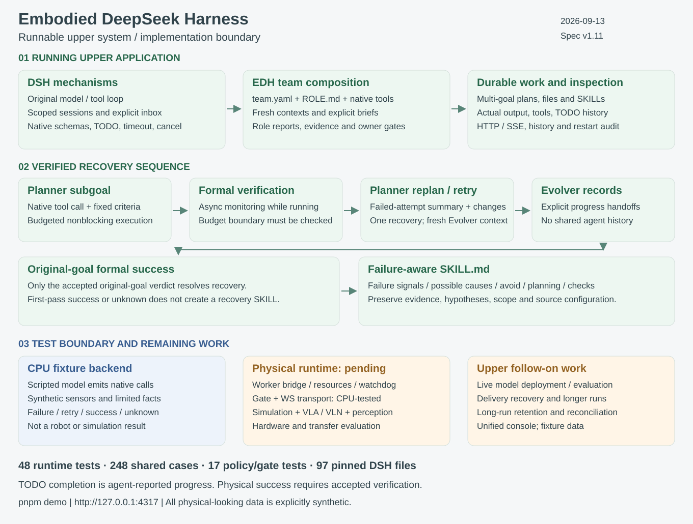

# Embodied DeepSeek Harness

**Composable agent teams for embodied intelligence.**

EDH is an independent physical-agent framework designed around user-defined
teams, explicit context handoff, replaceable tools and policies, asynchronous
verification, and reusable recovery experience. Its agent runtime incorporates
selected DeepSeek Harness implementations, with traceable provenance.

> **Early development: the upper workflow and local console are runnable.**
> DSH-backed roles, native tools/TODOs, formal verification, recovery and SKILL
> publication run with an explicitly synthetic CPU backend and scripted model.
> Real simulation, learned policies, live VLM evaluation and hardware remain pending.

[Project spec](docs/project-spec.md) ·
[Implementation plan](docs/implementation/plan.md) ·
[Current status](docs/implementation/progress.md) ·
[Capability map](docs/implementation/features.md)



The diagram shows actual capability. See [target architecture](docs/architecture/modules.md)
for the complete intended framework.

## Find your way

| Location | Responsibility |
| --- | --- |
| [apps/server](apps/server/README.md) | Application composition and host entry |
| [apps/console](apps/console/README.md) | Physical control panel |
| [harness/agent-runtime](harness/agent-runtime/README.md) | Agents, teams, models, tools, tasks, verification and memory |
| [harness/contracts](harness/contracts/README.md) | Shared schemas and generated wire types |
| [harness/physical-runtime](harness/physical-runtime/README.md) | Policy, simulator, embodiment and hardware boundaries |
| [examples](examples/README.md) | User-defined roles, teams, tools and skills |
| [tests/runtime](tests/runtime/README.md) | Keyless DSH runtime acceptance; physical fixtures remain synthetic |
| [docs](docs/README.md) | Architecture, decisions, implementation steps and handoff |

## Run the local demo

```sh
pnpm install --frozen-lockfile
pnpm demo
```

Open `http://127.0.0.1:4317`. Inspect agent output, TODOs, native tool calls/results,
explicit handoffs, verification and recovery. See the [upper-runtime guide](docs/implementation/upper-runtime.md).
The multi-goal scenario demonstrates failed placement, an access prerequisite,
placement recovery and final cabinet closure; see [the illustrated runtime guide](docs/implementation/multi-goal-runtime.md).

The fixture is an integration demo; it does not control a real or simulated robot.

## Run the checks

Use Node.js 22.19+ (the bootstrap was checked on Node 25), pnpm 11.19.0 and
Python 3.11+. From the repository root:

```sh
pnpm install --frozen-lockfile
python3 -m venv .venv
.venv/bin/python -m pip install -c harness/physical-runtime/constraints.txt -e 'harness/physical-runtime[policy]'
pnpm check
pnpm test:runtime
```

These commands check generated schema types, example structure/references,
TypeScript, documentation links and Python importability, then execute 48 upper-runtime
integration tests and shared wire/lifecycle validation cases in both languages. `test:runtime` runs that suite
alone. The optional policy extra enables 17 WebSocket/action-gate tests. No live model API or simulator is started. API tests start a temporary local server. No GPU or key is needed.
Python checks prefer `.venv/bin/python`, falling back to `python3`; override
`EDH_PYTHON` if needed. `pnpm test:contracts` runs shared TS/Python wire cases.

## Configure models and policies

The [adapter guide](docs/implementation/model-policy-adapters.md) includes a local vLLM /
remote OpenAI-compatible model example and a runnable WebSocket policy-to-action-gate
CPU example. The host-to-Python worker bridge and real provider integration remain next.

## Design commitments

- Define teams through role files and bindings; roles are not a fixed enum.
- Every new delegation gets a fresh context and an explicit task brief.
- The upper decision owner controls retry, replan and resume.
- The verifier can pause, monitors asynchronously, and must verify at budget expiry.
- Recovery skills serve planning and verification; publication requires formal
  success of the original recovery goal.
- Simulation comes first; hardware contracts remain explicit and real-device
  support requires its own verification.

See [DSH provenance](docs/provenance/README.md) for the pinned source baseline
and the [integration guide](docs/implementation/dsh-integration.md). EDH is not an official DeepSeek product.
