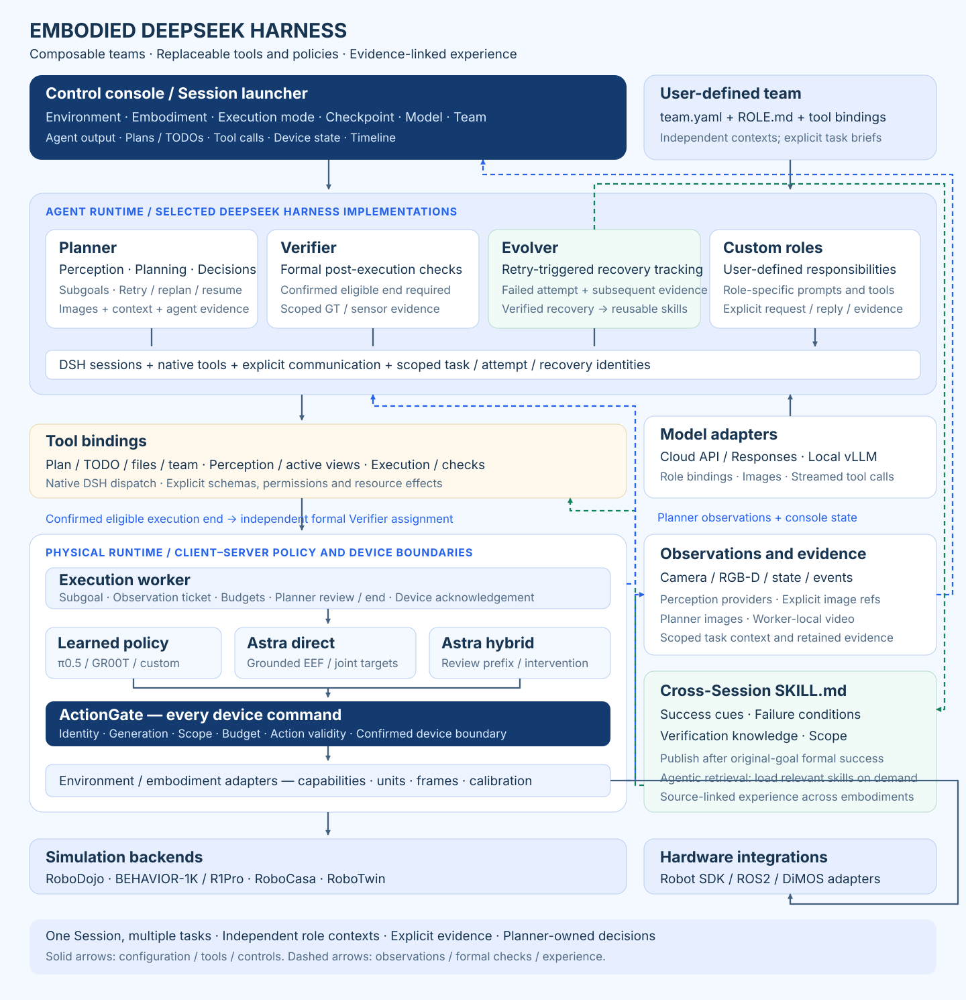
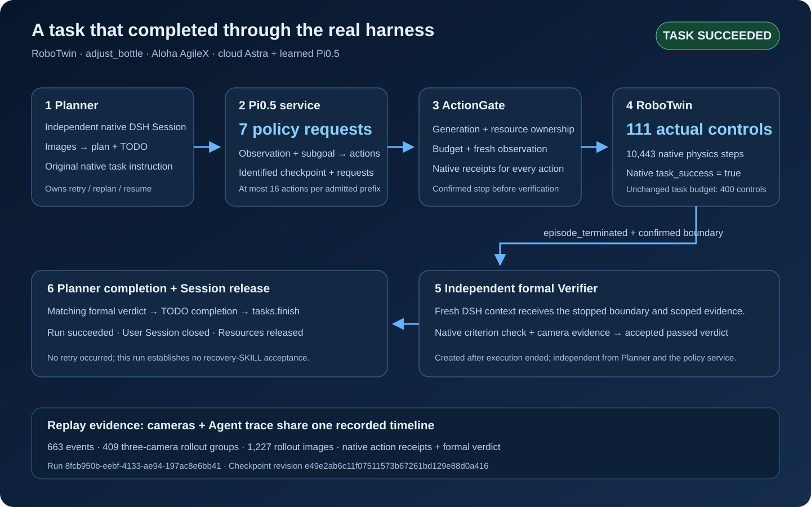
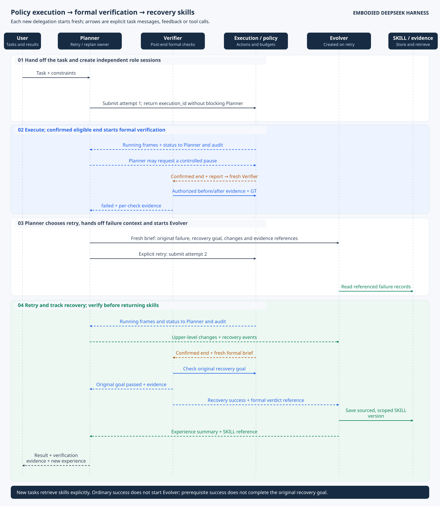

# Architecture and module ownership

EDH owns the application, agent roles, task coordination, physical boundary and
console. Selected DSH loop, tool dispatch, model transport and private Session
mechanisms are absorbed into its modules with source provenance. OpenAI-compatible
cloud/local model endpoints and learned/direct/hybrid WebSocket policy envelopes
connect through the same canonical ActionChunk and ActionGate.

Actual Qwen/Pi0.5 RoboTwin tasks verify failed attempts, explicit Planner retry,
independent formal success and resource release. Actual Qwen/Pi0.5 RoboDojo
execution verifies native task success after 59 controls and four learned
inferences. Its single-GPU run `551fa79d` additionally verifies retained-scene
retry, 61 controls and four identified inferences. Qwen/GR00T RoboCasa CloseDrawer
has native first-attempt success and separately accepted retained-scene recovery.
BEHAVIOR retains its observed unsuccessful task evidence, plus separate native
perception/active-observation checks. Reusable native
deployment factories validate configured Teams and task catalogs before allocation.
The independent device watchdog, process resource leases and hardware interface
have production checks; further native safety and complete release acceptance
are tracked in the [v1 register](../implementation/v1-delivery.md).
See the [adapter boundaries](../implementation/model-policy-adapters.md).

The recorded workflow illustrates run `8fcb950b-eebf-4133-ae94-197ac8e6bb41`:
independent cloud Astra Planner and Verifier Sessions, seven identified Pi0.5
inferences, 111 ActionGate controls, native task success and released resources.
It records no retry or recovery-SKILL publication. Local Qwen/Pi0.5 run
`7c158abe-a195-4575-b8bf-a58569da6127` separately validates headless task success,
107 real controls, independent formal verification and worker-local recording.
Its trace-only console requests no camera images. The exact evidence and remaining
acceptance are in the [Qwen handoff](../implementation/qwen-headless-checkpoint.md).

The diagram shows the framework architecture. Consult the
[capability map](../implementation/features.md) for implemented services and
remaining native acceptance. Selected DSH mechanisms are incorporated into the
module owners. See [runtime integration](../implementation/dsh-integration.md).

## One harness, two runtime responsibilities

Both sides are under [harness](../../harness/README.md). `agent-runtime` coordinates
agents, tasks, tools, verification and experience; `physical-runtime` advances policies
and interacts with simulators/devices. Shared `contracts` define their communication.
They may run on one host while retaining independent process and dependency boundaries.

For a cup-placement task, the upper side supplies the subgoal/budget and makes the
formal verification/retry decisions; the physical side returns real frames, control
steps, device acknowledgement and limited fact checks. Folder placement does not grant
the physical worker decision ownership or cause agent contexts to be shared.
Planner directly starts the policy execution. Verifier receives a fresh assignment
only after an eligible ended execution has a confirmed device boundary. The console
tracks Agent and execution state; headless simulator video is recorded on the worker
host. Authorized observation tools continue to supply images to models. See
[headless simulation](../implementation/headless-simulation.md).

## Working directories

| Module | Owns | Does not own | Main boundary / next step |
| --- | --- | --- | --- |
| `apps/server` | EDH application assembly, local HTTP/SSE API and startup | Agent loop implementation | startServer + ServerDeployment; Step 00/12 |
| `apps/console` | Team/agent/robot state, plans, tools, verdicts and Agent trace | Device truth or planner decisions | ConsoleProjection; Step 12 |
| `apps/desktop` | Native configuration selection, owned service process, console window and shutdown | Models, agent loops or physical allocation | Default deployment factory into existing startServer |
| `harness/agent-runtime/agents` | Independent assignments, DSH session lifecycle, built-in role definitions | Implicit parent context or another loop | AgentFactory; Step 03 |
| `harness/agent-runtime/foundation` | Plugin context, schemas, native registration scopes and selected runtime support | Another agent loop or physical policy | Pinned source and compiler boundaries; Step 00 |
| `harness/agent-runtime/teams` | Team/member definitions and immutable role/provider bindings | Hard-coded role enum | TeamLoader; Step 02 |
| `harness/agent-runtime/models` | Model capabilities and DSH model binding | Planning or tool orchestration | ModelRegistry; Step 00 |
| `harness/agent-runtime/tools` | Logical IDs, model-visible parameters, role/device schema selection, input limits and output evidence selection | Every concrete perception/robot implementation | Native DSH tools, core-inputs.ts, model-schema.ts and core-output.ts; Step 02/07 |
| `harness/agent-runtime/communication` | Explicit briefs, scoped messages, delivery and subscriptions | Shared conversation memory | TeamRouter; Step 04 |
| `harness/agent-runtime/planning` | Persistent PlanDocument and progress projection | Authoritative success | PlanStore; Step 05 |
| `harness/agent-runtime/files` | Private assignment files and controlled search | Shared unrestricted filesystem | AgentFiles; Step 05 |
| `harness/agent-runtime/tasks` | Goals, attempts, decision ownership and recovery linkage | Policy action generation | TaskCoordinator; Step 09 |
| `harness/agent-runtime/execution` | Host/worker bridge, job status and resource coordination | TS control loop or autonomous retry | ExecutionClient; Step 06 |
| `harness/agent-runtime/perception` | Model-facing capture/segmentation/depth/localization tool adapters | Shared global scene state | PerceptionProvider; Step 07 |
| `harness/agent-runtime/observation` | Active-view intent, resource effects and achieved pose | Assumption that turn-view only moves a camera | ActiveObservation; Step 07 |
| `harness/agent-runtime/verification` | Post-execution formal-verdict coordination | In-flight observation, retry, replan or ground-truth fabrication | VerificationCoordinator; Step 08 |
| `harness/agent-runtime/memory` | Native context measurement/compaction, authorized evidence access, skills, recovery experience and the planned initialized Session SceneState | Automatic shared prompts or VLA training | SkillStore/EvidenceReader; SceneState implementation pending; Step 10 |
| `harness/agent-runtime/storage` | Persistence primitives used through scoped service boundaries | Bypass of evidence visibility | EventStore/AssetStore; Step 04 |
| `harness/contracts` | Authoritative wire schema and generated declarations | Runtime semantic authorization | physical.schema.json; Step 01 |
| `harness/physical-runtime/src/physical_harness/execution` | Actual action progression, budget and device job handling | Upper-level retry decision | ExecutionWorker; Step 06 |
| `harness/physical-runtime/src/physical_harness/policies` | Subgoal-to-action policy adapter plus direct/hybrid GPT gateway normalization | Agent orchestration | SubgoalPolicy; Step 13 |
| `harness/physical-runtime/src/physical_harness/environments` | Native simulator observation/action/task mapping for BEHAVIOR, RoboCasa, RoboTwin and RoboDojo | Environment-specific host protocol implementation | EnvironmentAdapter; Step 13/15 |
| `harness/physical-runtime/src/physical_harness/embodiments` | Capabilities, units, frames and action/observation specifications | Simulator lifecycle | EmbodimentAdapter; Step 06/13 |
| `harness/physical-runtime/src/physical_harness/backends` | Device connection, commands and confirmed state | Agent-mediated emergency response | DeviceBackend; Step 06/16 |
| `harness/physical-runtime/src/physical_harness/perception` | Optional model/provider execution | Host role permissions | PerceptionProvider; Step 07/13 |
| `harness/physical-runtime/src/physical_harness/verification` | Limited GT/device fact checks | Final agent verdict | VerificationProvider; Step 08/13 |

## Direction of dependencies

Source interfaces depend on `contracts`; application assembly composes the modules.
The [source entry points](../development/code-map.md) identify concrete files for
each responsibility. Native Session operations live in `execution/worker.py`,
process communication in `execution/worker_transport.py` and original policy
records in `execution/policy_records.py` inside the physical runtime.
Native runtime mechanisms remain DSH-owned; see [reuse decision](../implementation/decisions/0003-reuse-dsh-mechanisms.md).
Application assembly connects the runtime services through explicit interfaces.
`tools/core-output.ts` selects model-facing image evidence from core results or
the calling Verifier's formal-check sample. UpperRun supplies that check context,
admits assignment grants/visibility and retains the native DSH result renderer.
`apps/server/src/native-deployment.mjs` owns native configuration and provider
assembly; `native-workspace.mjs` composes those providers into one application.
`examples/deployments` contains runnable entry points that call these modules.
Native policy startup, model identity and inference audit belong to
`physical_harness/policies/services`; existing example scripts import their
production `main` functions. The policy server and inference owner remain shared
modules in `policies`, and provider SDK loading stays inside selected startup.
`policies/observation_inputs.py` owns model-independent identity, RGB PNG and
float32 state admission. Native adapters retain their own modality mappings,
SDK preprocessing and action conversion.
Each adapter exposes `prepare_policy_input` for both online inference and actual
installed SDK CPU inspection. LeRobot's `prepare_model_input` also checks tensors
after its saved processor and before model inference. The processor diagnostic
uses original request and checkpoint sources with no policy network allocation.
`policies/gr00t_checkpoint.py` owns pre-SDK model/processor/statistics admission.
The two native GR00T constructors supply their ordered modalities, dimensions,
horizons and action semantics. Original SDK processing and inference remain with
`Gr00tPolicy`; file identity remains with the provenance reader.
`policies/gr00t_model_input.py` wraps the selected SDK collator and native bfloat16
conversion with floating-state and finite/noncomplex tensor admission before
model inference. Both GR00T constructors bind that same function; the installed
CPU diagnostic uses it with actual checkpoint processing and original requests.
`policies/gr00t_model_output.py` wraps the actual checkpoint processor's
`decode_action`. Both GR00T constructors bind it after policy construction. It
admits finite normalized float32 model values, configured horizon/channel capacity,
and exact decoded group keys, shapes and finite float32 range. Actual SDK
normalization, model padding and relative-to-absolute semantics remain unchanged.
Scoped NumPy arithmetic checks apply during decoding; native controller mapping
and ActionGate retain their existing owners.
The RoboTwin adapter's `prepare_checkpoint_processors` loads and admits actual
saved SDK processors before policy construction. Its constructor and installed
CPU diagnostic use that same feature, normalization and absolute-target admission.
`policies/action_outputs.py` owns real numeric array, positive dimension, shape,
finite-value, bounded action-count and optional float32-range admission. Each
GR00T provider exposes `native_action_record` in its existing module, shared by
online inference and original-record CPU inspection. Native group semantics,
Torch conversion and gripper/controller mapping retain their adapter owners.
`contracts` must not import agents, apps or Python.
Communication uses storage for persistence; agents receive authorized evidence
through memory/tools, not direct unrestricted storage handles. Python optional
providers must not be imported by the base package at startup.

For example, a SAM tool is defined in `tools`, exposed through `perception`, and
executed by the Python perception provider. A verifier role lives in `agents`,
formal-verdict lifecycle enforcement in `verification`, and a simulator predicate
check in the Python verification provider. These are different responsibilities,
not three implementations of the same agent.

`perception/metric_geometry.py` owns source-bound native RGB-D back-projection,
range statistics and camera/world surface coordinates. Scoped NumPy arithmetic
checks terminate overflow, invalid operations and division by zero before a
measurement is returned. `MetricCapture` retains capture identity and recording;
Worker retains observation ownership and confirmed-device admission.

## Recovery sequence

## Wire contract maturity

The authoritative schema has matching TypeScript/Python wire validation and
lifecycle gates for attempt identity, budgets, formal verdicts and recovery lineage.
Runtime services enforce role authority, explicit evidence access, registered event
payloads, resource ownership and confirmed execution boundaries. Native task
acceptance checks their integration with actual models and simulators. See
[contract integration](../implementation/contracts.md). Generated TypeScript and
Python Protocol annotations alone do not validate runtime data.

## User-session ownership

`apps/server/src/user-sessions.ts` owns the product conversation/environment lifecycle,
not an agent loop. A retained `SessionEnvironment` creates one fresh backend control
scope per task. `UpperRun` and the native DSH services continue to own task execution
and independent role contexts. Workspace SKILL storage outlives all three scopes.
`SessionTaskHistory` owns immutable task membership and the compact session history
count/latest reference. UserSessions admits tasks and invokes that publication before
run ownership and request completion. Startup migrates legacy inline task arrays;
task-context and SKILL-source readers resolve individual memberships explicitly.
See the [session guide and SVG](../implementation/user-sessions.md).

`apps/server/src/clarifications.ts` owns durable user questions and accepted responses.
UpperRun supplies assignment/goal/execution admission and delivers the answer through
native TeamSessions after the asking turn settles. The console owns drafts, explicit
submission and delivery-state presentation. Existing task criteria and device permissions
remain authoritative. See the [interaction guide](../implementation/user-clarification.md).

## Task catalog ownership

`TaskDefinition` and GoalBinding validation live in the tasks module.
`SessionTaskCatalogs` in the server owns immutable per-session catalog records and
their ownership/content checks. UserSessions captures the configured source during
environment admission; the HTTP service and console read the retained catalog.
Task admission confirms its digest before passing one definition to UpperRun and
the environment's task backend factory. See [task catalogs](../implementation/session-task-catalogs.md).

## Experience read ownership

SkillLibrary owns immutable experience documents and explicit full/section reads.
Its CommonMark reader preserves mandatory context and reference definitions while
reporting omitted sections. UpperRun binds the optional selection to the existing
native `skills.load` tool; each calling assignment receives its own tool result.
Role prompts own retrieval decisions. See the
[section API](../../harness/agent-runtime/memory/README.md#selective-section-reads).

## Sensor metadata ownership

`perception/SensorSamples` owns validation and immutable, run-scoped sensor metadata
publication through LocalStore. UpperRun owns assignment grants, visibility checks and
current sensor projections. AssignmentEvidenceGrants copies brief references at role
creation, accepts explicit extensions while that scope exists, and releases permissions
after role retirement cleanup or run shutdown. Retired brief references remain history.
The catalog reads requested records without accumulating
historical sample bodies. It stores image references; the deployment attachment provider
must supply and validate image bytes. The server owns its native attachment context,
injects `DeploymentServices.images` into deployment/environment/task factories, and
disposes it after consumers stop. Scoped image reads require persisted run ownership,
associated image references and agent-visible evidence. The Console presents
metadata and Agent trace; headless video remains on the simulator host. See the
[perception guide](../../harness/agent-runtime/perception/README.md) and
[image-service boundary](../implementation/image-storage.md).

## Journal maintenance ownership

VerificationContexts owns persisted formal-check identities, scopes, facts and evidence
references. UpperRun owns active assignment admission/release and still applies shared
verdict gates. SensorSamples owns the referenced observations. Native retirement releases
active check identities while preserving the stored record for host inspection.

VerificationBoundaries owns immutable run/execution/boundary admission records.
UpperRun publishes accepted execution status and creates a native formal role only
after an eligible `ended` state with a confirmed stop boundary. Ordinary `paused`
states permit Planner-authorized resume without a Verifier assignment. Shared lifecycle
validation continues to own budgets and resume authority. See
[verification boundaries](../implementation/verification-boundaries.md).

VerdictHistory owns immutable accepted results and exact summary-to-record validation.
UpperRun applies acceptance gates and publishes compact verdict entries after archive
read-back. Planner/recovery consumers, selected task context and source inspection
resolve complete results; the console uses the selected-result HTTP reader. See
[verdict history](../implementation/verdict-history.md).

WorkspaceHistoryIndex in `apps/server` owns the derived SQLite session/run summaries.
LocalStore supplies detached revisions, source-file checks and synchronous committed
change notifications. The application opens the index after startup reconciliation and
closes it before the journal. Index failure after source publication stops the current
store; reopening reconciles from the source. Page readers retain bounded candidates.
See [workspace index semantics](../implementation/workspace-history.md#persistent-summary-index).

LocalStore owns checkpoint format, record validation, atomic compaction and explicit
sequence-bound batch retirement. Retirement notifies derived readers to reconcile
removed keys and retained ownership. Application reference closure, preserved request
identities and SKILL sources must be established before exposing record deletion.
DomainRetention in `apps/server` owns configured reference inspection, source leases,
mandatory provenance/request retention and single-use versioned previews. Record owners
declare their namespaces and complete edges. Native deployments bind the production
ownership policy, source-image retention and HTTP/console maintenance admission.
Actual copied multi-session journals verify scoped retirement and restart consistency.
See [domain retention](../implementation/domain-retention.md).
SessionTaskHistory owns full published membership enumeration. The server's
sessionRecordOwners declares Session/request/catalog dependencies and validates reverse
task ownership before retention admission. Request identity archives preserve the
admission digest and retired source identities before the selected sources are deleted.
`evidenceRecordOwners` in the same application layer composes sensor, assignment and
verification readers to declare run/evidence/boundary/context dependencies. Perception
owns shared image metadata validation; the image provider owns byte integrity. These
declarations do not authorize agent access or certify physical task completion.
`reportRecordOwners` composes AssignmentReports and assignment/evidence readers to
declare report and receipt dependencies. Communication owns stored report validation,
immutable receipts and predecessor checks; native DSH continues to own message delivery.
`taskRecordOwners` composes assignment, recovery, report, evidence and verdict readers
to declare archived delegation and recovery dependencies. It checks explicit failed
and successful sources and every published recovery index, preserving source histories
needed by retained assignments and experience. `runRecordOwners` declares run projection,
configuration and restart dependencies, including selected historical task context and
published session membership. Its inline event inspector is explicitly versioned.
`RunEventReferences` declares typed event/message dependencies, resolves historical
report/verdict sources and checks recovery page contents. Its versioned extension
inspects deployment payload references; the same inspector handles legacy inline events.
Submission, plan, private files, clarification and native-audit owners participate in
the built-in application policy. Unknown extension namespaces require their own
versioned inspectors before history retirement can proceed.
The server
owns idle-state and sequence admission, terminal-task drain and HTTP exposure. The
console owns statistics and operation status. Compaction preserves all current keys
and independent evidence/event records; it does not grant record access or set domain
retention policy. [Maintenance guide](../implementation/storage-maintenance.md).

SessionHistory owns publication and resident event-body budgets; native Session owns
the logical sequence and verifies archived values before release. TeamSessions supplies
pre-step, delivery and retirement checkpoints. Deployment policy records the count/byte
limits, and UpperRun emits release statistics. Active model context and application
projections remain separate owners. See [native history](../implementation/session-history.md).

AssignmentHistory owns immutable retired role payloads and compact run summaries.
UpperRun invokes it at native retirement; TeamSessions verifies its durable reader
before releasing the resident brief. The server checks run ownership for selected
detail reads, and the console keeps only selected historical payloads. See
[assignment history](../implementation/assignment-history.md).

LocalImageStore owns streamed image inventory, its mutation revision and exclusive
request-cache cleanup. The server owns idle admission and exposes an optional
maintenance controller for custom native image providers. Original objects remain
available after cache cleanup. Original-object collection uses configured reference
leases, journal write holds, SKILL source checks and confirmed session resource release.
The server validates a fresh inspection token before deletion; deployments must declare
complete external ownership. See [image retention](../implementation/image-retention.md).
