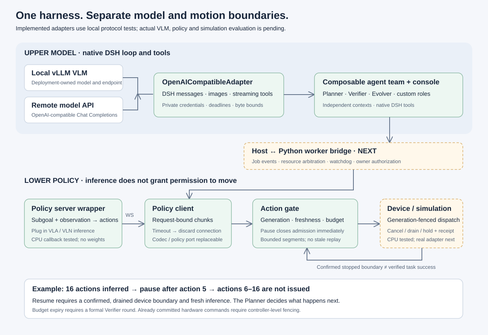
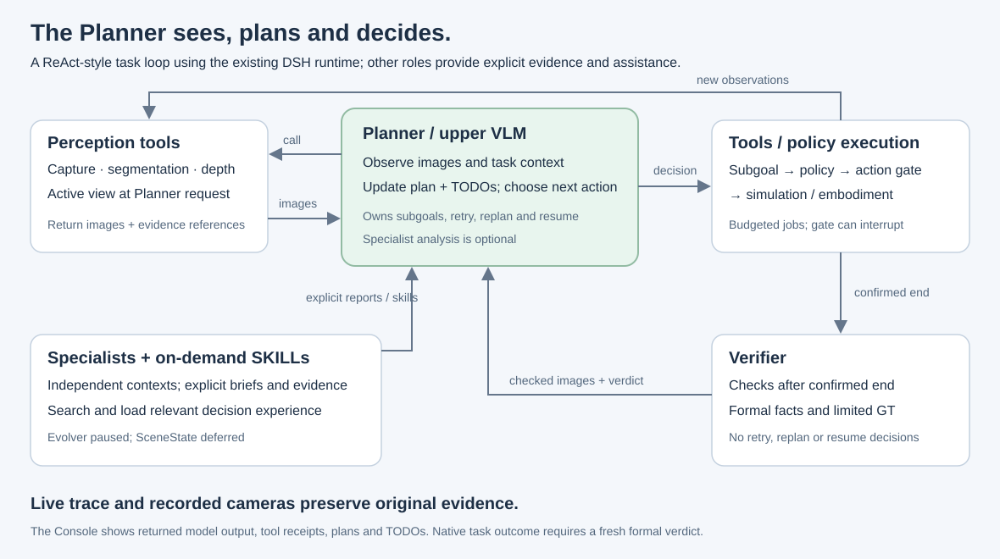

# Model endpoints, policy transport and action admission

Status: 2026-09-19. Both adapters and the action gate are executable and tested with
local HTTP/WebSocket peers. No live VLM, learned VLA/VLN, simulator or hardware has
been evaluated. The existing console still uses a CPU physical fixture. A host-to-
Python execution worker bridge remains the next integration step. Profile selection and
compatibility preflight are documented in [physical stack profiles](physical-profiles.md).



## Upper model: one native DSH adapter

[OpenAICompatibleAdapter](../../harness/agent-runtime/models/src/openai-compatible.ts)
extends the original DSH LlmAdapter. It uses absorbed DSH message/image serialization,
SSE parsing and tool-call translation. The existing DSH agent loop still owns tool
execution, follow-up, model retries and cancellation. The extra source imports and
one strict stream-completion patch are recorded in [provenance](../provenance/dsh-imports.json).

Local vLLM and remote services use the same Chat Completions binding. Set `baseURL`
to the API root, including `/v1` when required; the adapter appends
`/chat/completions`. Model IDs and advertised image capability come from deployment
configuration, not an assumed provider catalog. Native Anthropic/Gemini protocols,
OpenAI Responses and Realtime are outside this adapter.

Run the [configured console example](../../examples/deployments/openai-compatible.mjs)
from the repository root after supplying actual endpoint/model environment values:

```sh
pnpm exec tsx --tsconfig tsconfig.runtime.json examples/deployments/openai-compatible.mjs
```

| Binding                   | Configuration                                                                                                   |
| ------------------------- | --------------------------------------------------------------------------------------------------------------- |
| Local vLLM                | `EDH_MODEL_BASE_URL=http://127.0.0.1:8000/v1`; `EDH_MODEL` must match the served model name                     |
| Remote compatible service | `EDH_MODEL_BASE_URL` is its documented HTTPS API root; use its actual `EDH_MODEL`                               |
| Authentication            | Optional `EDH_MODEL_API_KEY`, loaded privately from the environment; never put keys in team YAML or commit them |
| Console                   | Port 4319; starting a task makes model requests; physical execution remains synthetic                           |

The endpoint must support streaming Chat Completions and function tool calls. A
vLLM model needs its appropriate chat template and tool parser; protocol compatibility
does not make every checkpoint a capable tool-using VLM. Consult the deployment's
[vLLM server documentation](https://docs.vllm.ai/en/latest/serving/online_serving/openai_compatible_server/)
and [tool-calling configuration](https://docs.vllm.ai/en/latest/features/tool_calling/).
The wire format follows the [Chat Completions reference](https://developers.openai.com/api/reference/resources/chat/subresources/completions/methods/create).

## Planner-owned perception and decision loop



The Planner is the perception, planning and decision-making VLM. Its native DSH
loop follows observe -> plan/decide -> call tools or start a subgoal -> observe.
`perception.capture` and `observation.turn_view` return images directly to the
calling Planner. Optional scene-analysis roles do not sit between all observations
and the Planner and do not take over its decision authority.

A backend can now supply `SensorSample.images` containing admitted immutable DSH
ImageAttachmentRefs. Native capture/active-view/evidence-read results include image
content blocks; formal checks include checked images in the Verifier's tool result.
A formal verdict delivers both that checked observation and its images to the Planner,
which uses them alongside context and other agents' explicitly returned evidence.
Async monitor assignments also receive their frame as image content, not only JSON.
The default Planner prompt and the single-goal CPU fixture observe before planning.

Explicit role handoff can carry admitted images, but never transfers the caller's
whole conversation. An assignment cannot read evidence it was not granted. Sample
metadata/source are bounded and validated; evidence IDs and attachment IDs cannot
be rebound to new content/metadata within a run. Debug-only evidence is refused on
agent-facing observation paths. Raw bytes remain outside domain state and event logs.
The native DSH attachment reference is reused rather than adding a second media SDK.

For real camera inputs, provide `resolveImage(ref, signal)` on the adapter. It must
resolve an admitted immutable DSH image attachment into bytes and matching metadata.
The adapter sends inline image data, including tool-result images; it does not let
the model fetch arbitrary local paths or URLs. The current fixture supplies sensor
metadata only, so the default example does not demonstrate a live camera pipeline. A deployment supplying
admitted image references and the matching resolver can now exercise the upper path. Image
resolution and credential callbacks must cooperate with cancellation.

Optional settings include `systemRole`, `maxTokensField`, `timeoutMs`, image count
and request/response byte bounds. `extraBody` supports endpoint-specific options
such as vLLM template arguments, but cannot replace messages, model identity or tools.
Reasoning-content history replay is opt-in (`passReasoningContent`); model output
must never be presented as access to otherwise unavailable hidden reasoning.

HTTP errors expose status, request ID and retry metadata without replaying provider
error bodies. Redirects are rejected. Truncated streams, missing finish reasons,
oversized responses and deadlines fail explicitly rather than becoming successful
answers. No automatic transport retry is added beneath DSH.

The HTTP adapter reads at most the smaller of 64 KiB and `maxResponseBytes` from
candidate 400/413 JSON errors. EDH's narrow compatibility rule maps exact
`error.code: "context_length_exceeded"` to DSH's canonical context error. It does
not classify arbitrary request-size failures or search error prose. The original
HTTP status/request ID remain available; provider body text is never copied into
errors or audit records. Reads retain the request deadline and cancellation signal.
With automatic context management enabled, native DSH owns bounded compaction and
retry. Without useful reduction, the original error terminates the turn. See the
[context guide](context-management.md). This is an adapter convention tested with
local peers, not a claim that every compatible endpoint uses the same error code.
OpenAI's [error guide](https://developers.openai.com/api/docs/guides/error-codes)
distinguishes bad requests, authentication, rate limits and internal failures; the
adapter preserves those distinctions rather than applying compaction to all errors.

## Lower policy: an independent inference server

Install the optional transport dependency:

```sh
.venv/bin/python -m pip install -c harness/physical-runtime/constraints.txt -e 'harness/physical-runtime[policy]'
.venv/bin/python examples/policies/websocket_roundtrip.py
```

The example starts a local socket server and a synthetic one-joint device, executes
four actions to 0.4 radians, then reports `budget_exhausted` with a confirmed stopped
boundary. It prints that formal verification is required; it does not invent an
agent verdict. No GPU/model download is involved.

- [WebSocketPolicyClient](../../harness/physical-runtime/src/physical_harness/policies/client.py)
  sends one canonical `PolicyRequest` and receives one `ActionChunk`. It supports
  `ws`/`wss`, optional bearer authentication, bounded messages and cancellation.
- [serve_policy](../../harness/physical-runtime/src/physical_harness/policies/server.py)
  wraps a deployment-owned asynchronous inference callback. Bind model loading,
  preprocessing and inference inside that server; offload blocking GPU calls from
  the event loop and bound their work. Shutdown must close and await the server.
- `PolicyCodec` changes request/response encoding. The default is EDH JSON, not
  universal compatibility with every WebSocket policy server. An existing server
  with a welcome handshake, session lifecycle or multiple response frames needs
  its own `SubgoalPolicy` implementation. A stateless MessagePack encoding can use
  a codec, provided canonical identity and action semantics remain checkable.

Timeout or cancellation discards the connection. A late result cannot become the
next request's result; inference is never silently replayed. One client allows one
in-flight inference. An invalid response cannot bypass ActionSpec dimensions,
channel bounds or requested action count. The server returns a generic failure
rather than model paths, request bytes or credentials.

The optional transport uses the [websockets asyncio client/server API](https://websockets.readthedocs.io/en/stable/reference/asyncio/client.html).
The base contracts package imports without loading this dependency.

## The action gate remains between policy and device

[ActionGate](../../harness/physical-runtime/src/physical_harness/execution/action_gate.py)
is deterministic. [PolicyRollout](../../harness/physical-runtime/src/physical_harness/execution/policy_rollout.py)
composes inference and gated dispatch. Policies never receive the device object.

| Contract              | Meaning                                                                                                                                 |
| --------------------- | --------------------------------------------------------------------------------------------------------------------------------------- |
| `PolicyRequest`       | Subgoal instruction, observation payload/reference, execution/task/attempt identity, generation, expiry, ActionSpec and maximum actions |
| `ActionChunk`         | Actions echoing the exact request identity, observation, expiry and action-space binding                                                |
| `ActionSegment`       | A bounded part of that chunk with its own segment ID                                                                                    |
| `ActionReceipt`       | Device acknowledgement of how many issued actions actually executed                                                                     |
| `StopAcknowledgement` | Generation-bound device confirmation; a confirmed stop requires a boundary ID                                                           |

The gate uses local monotonic time for admission. Wire UTC expiry is echoed for
correlation; it does not rely on a remote policy server's clock. Deployment code
must supply the observation's local acquisition time, never restamp an old frame
as fresh. ActionSpec declares embodiment, coordinate frame, control mode, channel
units, bounds and frequency. Device adapters enforce actual timing and control
semantics; a valid number alone is not a compatible robot command.

For a 16-action chunk with a one-action committed segment, a pause after action 5
invalidates actions 6–16. Pause immediately closes admission and advances generation,
then requests device stop. Resume needs a confirmed, drained boundary and a fresh
inference ticket. Old results remain invalid after resume. If a resume request may
have reached the device but its acknowledgement is lost, the gate requests a new
stop and withdraws the earlier stopped confirmation.

A lost dispatch receipt still consumes reserved budget. The gate does not retry
an uncertain physical effect. Unconfirmed stops keep admission closed. The worker
must retain the resource lease and reconcile actual device state. A failed stop
remains observable; delayed matching acknowledgement can complete it. Repeated
matching confirmation is idempotent.

**Device obligations:** fence generations at the actual command queue; do not let
an old dispatch or resume arrive after a newer stop and reopen movement. Implement
cancel/drain or robot-specific hold, declare committed segment size and measure
stop latency. The gate cannot retract already committed external commands. Its
`lease_valid` callback checks ownership; it is not a resource arbiter. The future
worker must authenticate Planner resume authority and route pause/stop/budget states
to the upper execution and verification services.

During a rollout step, inference and dispatch are bounded by observation and wall
deadlines. Between steps the execution worker must run an independent budget/watchdog
and stop on lease loss, process failure or shutdown. That worker and independent
watchdog are not implemented by this standalone component. Async callbacks must
cooperate; hardware needs its own command fencing/watchdog regardless of Python
cancellation. Gate state is diagnostic local state, not a published ExecutionStatus
or a formal VerificationResult.

## Acceptance and next integration

Local HTTP tests run the original DSH loop through tool calls, image results and
final response, plus stream/error/cancellation cases. Four additional upper tests
cover real capture-to-model HTTP images, explicit handoff, immutable evidence and
the Planner observe/plan/act/verdict-image loop with CPU execution. Seventeen Python tests exercise
real local WebSockets and CPU devices, including pause during inference/dispatch,
resume races, lost acknowledgements, budgets, expiry, lease loss, malformed/oversized
messages and shutdown failures. Eighteen shared schema cases cover new wire shapes
in both TypeScript and Python. These establish transport/admission behavior only.

Next: implement the host-to-worker bridge and resource/watchdog lifecycle, publish
actual gate/device events to the console, then bind a chosen simulation and policy
server. Validate real sensor attachments and live VLM tool use. Preserve mandatory
Verifier rounds at budget boundaries and Planner-only retry/replan/resume.

## Upper resume authority

Before the worker bridge is connected, its upper port now checks an exact formally
verified pause and records an explicit Planner resume decision. Providers receive
execution/boundary/state-version preconditions and must publish the matching update
before acknowledging. An unsolicited `running` update cannot borrow the owner ID
from an old subgoal. See the [execution contract](../../harness/agent-runtime/execution/README.md)
for failure, concurrency and late-acknowledgement semantics.

## Provider profiles

Use a [physical stack profile](physical-profiles.md) to bind a simulator, embodiment
and policy without changing the DSH upper loop. The profile carries the embodiment
observation/action contract, role-specific prompt context and policy preprocessing
metadata. openpi's WebSocket and GR00T's ZMQ transports remain separate provider
adapters behind the same canonical PolicyRequest/ActionChunk boundary.
