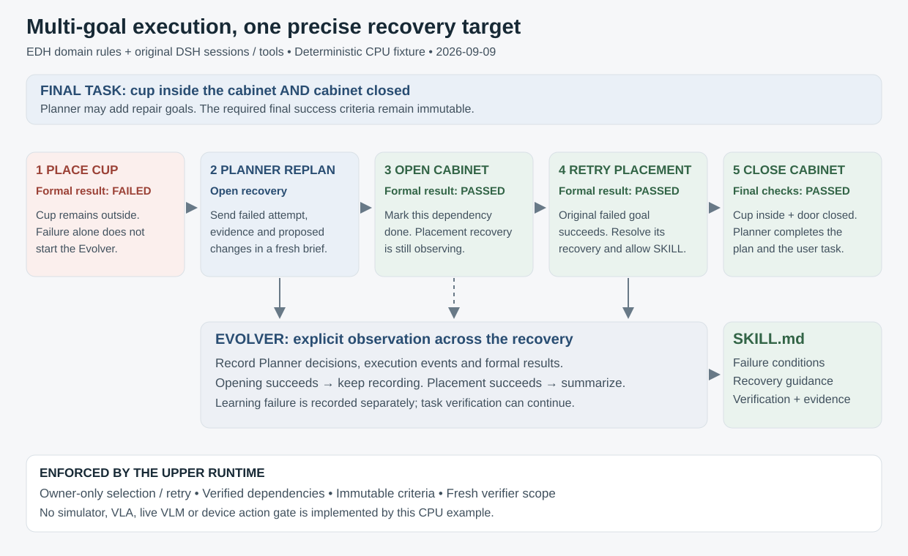

# Plan-selected subgoals and recovery

## Actual provider history checks

`scripts/check-recorded-session-continuity.mjs` reads a captured console journal through
production LocalStore, SessionTaskHistory, SessionTaskCatalogs, RunHistory, TaskGoals,
AssignmentHistory, VerdictHistory and historical task-context admission. It checks
complete membership and reverse ownership, immutable native catalog criteria, per-goal
attempt limits, independent role identities, actual requests and confirmed execution
boundaries, accepted verdict sources, retired contexts and final Session resource release.
It writes its audit into `.local/checks/` using a copy of the captured journal.
It executes no model, native SDK or policy job.

```sh
pnpm exec tsx --tsconfig tsconfig.runtime.json scripts/check-recorded-session-continuity.mjs .local/work/custom-role-demo-20260930/remote-acceptance/console
pnpm exec tsx --tsconfig tsconfig.runtime.json scripts/check-recorded-session-continuity.mjs .local/work/behavior-workflow-demo-20260930/data --require-multiple-tasks
```

Native RoboTwin histories `ef8f9d03` and `686c9767` pass these source-bound checks for
failed-attempt recovery, final formal success and released resources. The actual BEHAVIOR
journal contains a retained Session with two task admissions: `0906473e` fails before
execution; `0b7da1de` subsequently completes three policy attempts and three independent
failed Verifiers. Both retain independent run/role identities and inspectable context;
the Session closes with released resources. This confirms admission/history continuity
for the recorded outcomes. Successful multi-task continuation needs its own actual run.

RoboCasa, RoboTwin and BEHAVIOR expose the original `task_success` check. RoboDojo
`build_tower` also exposes `tower_base_structure` and `tower_middle_structure`,
bound to the original native structure predicates. Its deployment catalog admits
`native_tower_base_structure` and `native_tower_middle_structure` with empty
argument lists. Other RoboDojo tasks expose `task_success`. Additional prerequisite
conditions require provider-supported checks and authoritative catalog bindings.
The auditor reports actual
multiple-task history and distinct goal-condition sets separately. Supply
`--require-distinct-goals` to require an actual recorded multi-goal history with different
admitted conditions. Repeated attempts of one goal preserve their source identities.

`planning.read.planWrite` supplies complete structured next-write arguments. Planner
decides item statuses and dependencies; selecting or completing one prerequisite still
requires that goal's current formal success. The final task retains its original
criterion and requires its own latest confirmed verification boundary.

DSH owns model turns, scoped tool dispatch, Sessions and explicit follow-ups.
TaskGoals and TaskPlans supply task identity, goal admission, immutable criteria
and dependency validation; UpperRun assembles execution and formal-verification
transitions. Current native Teams disable learning; Evolver work remains paused.



## Native multi-goal workflow

The [native release campaign](native-release-campaign.md) submits the configured
RoboDojo `build_tower` task with a three-goal requirement. Planner reads the actual
Session catalog, commits the original final criterion and declares dependencies:

| Goal condition | Admitted check | Transition requirement |
| --- | --- | --- |
| Base structure | `tower_base_structure` | Its own confirmed execution boundary and passed formal verdict |
| Middle structure | `tower_middle_structure` | Base plan row completed with its current passed verdict before selection |
| Original complete task | `task_success` | Required prerequisites complete; original final criterion passes at the latest confirmed boundary |

Planner determines concrete goal IDs, instructions, budgets available through the
catalog and recovery decisions. Failed or unknown attempts preserve their observed
outcomes. Formal success must come from the independent Verifier and current native
facts. Original Tower task completion and the full prerequisite/recovery sequence
retain actual model/policy/simulator acceptance requirements.

## Bind task criteria and available checks

`ApplicationOptions.goal` is the required final task, including its success contract,
entity bindings, capability requirements, source configuration and execution budget.
`allowedSubgoalChecks` registers exact `SuccessCheck` objects, including bound entity
arguments. `predefinedGoals` optionally supplies complete deployment-owned bindings.

For example, the configured RoboDojo Tower catalog admits the two native structure
checks while retaining `task_success` for the original final task. Planner may
combine registered checks using `all` or `any`; check arguments and source identities
must match their admitted bindings. Newly named checks require an actual provider
implementation and catalog admission.

`planning.read` returns the complete plan, owner IDs, active goal/attempt, final goal
ID, admitted bindings, allowed checks and `subgoalSource`. New Planner-authored
contracts use that exact source. Its current wire representation is
`{ kind: "user", reference: "planner-subgoals:<finalGoalId>" }`: this records delegated
user-task planning authority, not a claim that the user manually authored each subgoal.
The wire schema still has only user/benchmark source kinds.

Dynamic goals inherit the root binding's entities, capabilities, budget and source
configuration; their description augments task semantics. Use predefined bindings
when a subgoal needs different deployment-provided budgets or capabilities. General
predicate parameter discovery and arbitrary environment entities are future provider
work. Complete goal criteria become immutable on admission, even before execution.

## Native tool sequence and guards

1. Call `planning.read`, then `planning.update({ plan, expectedVersion })`. Retain the
   final goal and every executed goal with the exact criteria used for execution.
   Updates are owner-only, versioned, cycle-free and bounded to 64 admitted goal
   identities across the task's history, including goals later removed from a plan.
2. Call `tasks.select_goal({ goalId })`. The selected goal must be in the plan and
   not abandoned. Every dependency must be done and reference its own latest formal
   passed verdict matching its latest request. Selection waits for confirmed ended
   execution and formal verification of the previous job's latest boundary.
3. Call `execution.start({ instruction })`. The selected binding supplies the
   SubgoalRequest's identity, criteria, budget and capabilities. The tool rechecks
   dependencies and rejects duplicate submission of an already-started attempt.
4. After an eligible `ended` state with a confirmed device boundary, a fresh Verifier
   receives the current request's criteria. Ordinary confirmed pauses remain with
   Planner and do not create a formal assignment. Checking and submission are bound
   to that execution and boundary. Old verifier assignments cannot verify a later
   goal or attempt.
5. Following formal failure, `tasks.replan` or `tasks.retry` must include an attempt
   summary and proposed changes. Replan before selecting a different repair goal.
   Returning to the failed goal restores its prior attempt; call `tasks.retry`
   explicitly before starting again. The limit is three actual executions per goal,
   not three executions for the entire multi-goal task.
6. Mark completed plan items with their own latest verdict IDs. An old success cannot
   hide a later failed or unverified attempt. Call `tasks.finish` only when the final
   task goal passed at the backend's latest confirmed stopped boundary and all plan
   rows are done or explicitly abandoned. The final goal cannot be abandoned.

New attempts receive unique increasing ordinal IDs. `RunState.attempt` identifies the
currently selected attempt; it can temporarily return to an older ordinal when
selecting a previously failed goal, before an explicit retry allocates a fresh ID.
`activeGoalId`, `finalGoalId` and `activeRecoveryId` make these states explicit.
`recoveryId` retains the most recently opened recovery for existing history inspectors.
The initial Planner brief stays immutable; verdict followups explicitly provide the
current subgoal context. A new role assignment never inherits Planner conversation.

A completed dependency is a historical formal result, not a continuously true world
invariant. Planner must create a new goal identity to re-establish a previously passed
condition when later work invalidates it. The final task checks its required conditions
again at its own latest execution boundary. Passed goals are not blindly rerun under
an already-completed attempt ID.

## Recovery lifetime

One recovery chain observes at a time. It can encompass several repair goals and
retries without changing its original failed goal. Only a passed result for that
original goal, contract and recovery identity resolves it. Successful prerequisites
are progress, not recovery completion. Resolved records and Evolver assignments keep
their own goal/failed-verdict/success-verdict provenance while the task continues.

Recovery creation captures the complete brief before asynchronous role creation.
Evolver startup/model work does not gate policy execution. Explicit progress batches
are ordered after its start message; success follows those batches. `skills.save`
uses the recovery's captured success, not whichever unrelated verdict is now last.
A failed Evolver model writes `recovery.failed` and a durable error; the Planner and
Verifier can still complete the physical task. No success skill is fabricated.

## Recovery progress storage and delivery

RecoveryHistory stores the explicit failed-attempt context, result, learning error
and published trace count under `recovery:<id>`. Each `recovery-event:<id>:<index>`
stores an immutable reference to an already published run event. The recovery record
contains no accumulated event bodies. Failed learning can retain subsequent progress
for later inspection. A resolved recovery accepts no additional events.

Readers use recovery indices because selected run sequences can contain gaps. Pages
contain at most 32 events and target 64 KiB of encoded event bodies. An oversized
individual event remains intact in its own batch. Page reads validate reference order,
the published run boundary and the referenced event. Unpublished references stay
outside the recovery count. Legacy inline traces remain readable.

UpperRun starts one progress drain after the Evolver's start message has completed.
It reads each batch when ready to send and advances its cursor after native DSH
delivery settles. Incoming progress grows the durable trace without queuing arrays
of event bodies. Concurrent flush requests await the active drain and check for
remaining progress. The original-goal success message waits for progress delivery.
Errors propagate to the existing learning-failure handler and preserve the stored
trace; restarting the server never resumes an Evolver or replays task actions.

The existing recovery HTTP endpoint explicitly reconstructs a complete trace for
inspection. This response and legacy inline records can allocate the requested
history. Agent session context, indexed reference count, journal disk usage and
working-file limits have separate lifecycles. Delivery settlement means native
session quiescence; it does not prove the quality of learned guidance.

`pnpm test:history` includes actual journal checks for ordered selection, stable page
boundaries, detached bodies, UTF-8 byte sizes, large individual records, legacy reads,
reopening, invalid references and traces exceeding the 8 MiB record limit. These
checks use authored history documents and do not simulate model or physical behavior.

## Acceptance

[CPU validation](cpu-release-validation.md) checks original native requests,
canonical model-visible parameters, accepted/rejected plan writes and generated
read-only next-write arguments. Original records retain their hashes and verdicts;
these checks execute no models or physical controls. Session audits publish native
events independently, allowing complete history to exceed the 8-MiB record limit.
The repository-wide source command is `pnpm check`.

The [native campaign](native-release-campaign.md) and its recorded-task reader
require current-code model/policy execution, independent Verifiers, prerequisite
ordering, completed plans/TODOs, exact terminal boundaries and released resources.
Each provider's original source/action/video audit remains part of task acceptance.

The current upper application admits one active retained User Session with sequential
physical jobs, one observing recovery chain, fixed deployment-bound check arguments,
bounded Session/event/file budgets and read-only interrupted-run history. Each supported
native task combination retains its own physical and formal-verification acceptance;
see [progress](progress.md). Successful native RoboTwin and RoboDojo retained-session
continuation has its recorded acceptance. Current-code Tower completion and further
provider configurations require the actual evidence described above. Evolver
remains paused and SceneState remains deferred.
