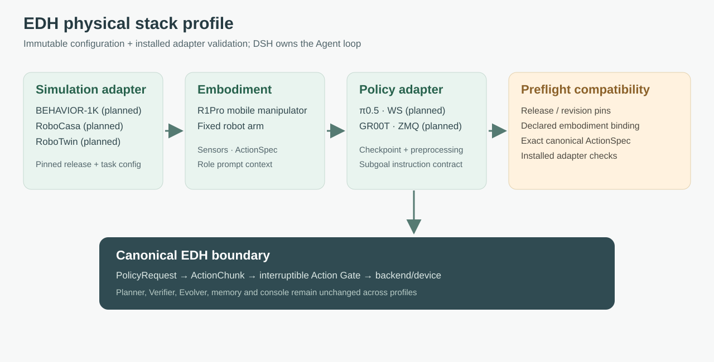

# Configurable physical stack profiles

A deployment can supply a `physicalProfile` independently of its Team/Role, upper
model and task presets. The profile describes the simulator, embodiment and policy;
registered adapters validate their SDK-specific settings before run history is
opened or any backend is allocated. DSH still owns the Agent loop.



## What is implemented

The shared [schema](../../harness/contracts/schema/physical.schema.json) generates
profile types. [Profile resolution](../../harness/agent-runtime/execution/src/profiles.ts)
validates JSON shape, rejects placeholders and freezes a detached snapshot. It checks
simulator/policy declarations against the selected embodiment, validates both ActionSpecs,
requires exact equality of canonical action channels, frame, units, limits, frequency and
version, and checks policy observation mappings against declared sensor channels.
`acceptedInstruction` must be `subgoal`. Transport names are open identifiers: a new
client protocol does not require editing a framework-wide enum.

The deployment must register `physicalProviders.simulations[provider]` and
`physicalProviders.policies[provider]` synchronous validators. They must reject
unsupported releases, options, checkpoints/transforms or sensor layouts, without
launching a process. Their implementations remain trusted deployment code. The
framework cannot establish physical compatibility merely from self-declared metadata.

The resolved profile is included in the deployment digest, `/api/config`, historical
configuration and backend factory's `{ signal, profile }` argument. The factory must
actually use it and enforce the existing Action Gate boundary. Replacing a config
never rewrites prior run records. Increment deployment version when adapter code changes.

## Configuration fields

| Section | Required information |
| --- | --- |
| `simulation` | ID/provider, repository, release, immutable revision, declared embodiments, task adapters, provider config |
| `embodiment` | ID/family, canonical ActionSpec, observation channel names, required tools, prompt context |
| `policy` | ID/provider/model family, source pin, transport, declared embodiments, subgoal support, canonical output ActionSpec, checkpoint, normalization reference, observation mapping, action transform version, provider config |
| `rolePromptAdditions` | Optional text keyed by Team member alias, such as `lead`; unknown members fail preflight |

Keep credentials out of these public fields. Supply them privately to adapters.
`normalizationRef: "none"` is an explicit declaration and still needs adapter validation.
Policy ActionSpec describes the output **after** its declared action transform, which
must preserve the checkpoint's actual rotation, gripper and action semantics. A shape
match alone cannot prove that an arbitrary model works on a robot.

For example, a deployment can read a JSON profile file and pass it unchanged to
`startServer`. Change that file to select another **installed and compatible** provider:

```ts
const physicalProfile = JSON.parse(await readFile(profilePath, 'utf8'));
await startServer({
  root, dataDirectory, port: 4317,
  deployment: {
    ...baseDeployment,
    physicalProfile,
    physicalProviders: {
      simulations: installedSimulationValidators,
      policies: installedPolicyValidators,
    },
  },
});
```

This is a composition excerpt, not an installed-provider example. Existing task backend
factories receive the chosen profile. New SDKs still need an adapter implementation;
subsequent scene, camera, task, robot, endpoint and checkpoint changes can use its
validated config. There is no arbitrary module-import or shell-launch field.

## Role context and tools

The embodiment context is appended to every fresh role's base instructions; per-member
additions are appended once to that member only. The resulting prompt is hashed and
stored with team configuration. It is not an implicit exchange of private conversations.
The current context contributor also survives history compaction. Base ROLE.md files,
model bindings and exposed tools remain independently selectable through existing teams.

R1Pro prompts may describe mobile manipulation and its actual available viewpoints.
Fixed-arm prompts must describe the configured workspace, cameras and arm capabilities.
Do not infer those capabilities from a simulator name. Use role tool lists to remove
unavailable navigation/active-view tools; prompt text alone does not revoke permission.
Required tool IDs must be registered. The existing owner/verification gates still apply.

## Planned providers and source audit

Official release listings checked on 2026-09-19 identify these simulation baselines:

| Project | Release | Immutable revision |
| --- | --- | --- |
| [BEHAVIOR-1K](https://github.com/StanfordVL/BEHAVIOR-1K/releases/tag/v3.9.2) | `v3.9.2` | `b1979916ec1549b10a4e65e630bc6504a9af1b00` |
| [RoboCasa](https://github.com/robocasa/robocasa/releases/tag/v1.0) | `v1.0` / RoboCasa365 | `8f3c96ec8d1bfcd8126cad2bca887da98d30e997` |
| [RoboTwin](https://github.com/RoboTwin-Platform/RoboTwin/releases/tag/release) | `release` / Stable Version | `bf44be51cf5717a5595ce59447f2cf5263d2aa95` |

These are reference pins, not executable robot profiles. R1Pro and the specific arm
models need actual camera/joint/controller/task configuration from the chosen provider.
No generic four-channel ActionSpec or camera list is assigned to those robots.

[openpi](https://github.com/Physical-Intelligence/openpi/blob/main/docs/remote_inference.md)
uses WebSocket for remote policy inference. Its inspected source revision is
`215abfb217dbac7d5f1273282331b9b1866c0479`; a main-branch snapshot is not a stable release.
π0.5 is a priority family, with exact fine-tuned checkpoint and preprocessing left to
deployment. [GR00T](https://github.com/NVIDIA/Isaac-GR00T) documents ZMQ server/client
inference. N1.7 source tag `n1.7-release` resolves to
`23ace64f17aa5015259b8609d371eb61a357c776`; N1.6.1 is a separately maintained release.
Do not infer policy quality or cross-embodiment support from the release label.

## Acceptance and remaining work

CPU tests check malformed/unknown fields, action and observation mismatches, missing
provider validators, immutable config, prompt isolation and unknown role aliases.
Two synthetic profiles complete the existing HTTP/DSH/Verifier task pipeline with the
same upper loop; the selected profile reaches the backend and persisted configuration.
Shared TypeScript/Python tests cover profile wire shape, not cross-provider compatibility.

Real simulation adapters, openpi/GR00T clients, GPU weights, learned checkpoint evaluation,
worker transport and device resources/watchdog remain pending. Policy inference must map
to PolicyRequest/ActionChunk and pass through the interruptible Action Gate before device
execution. Configuration does not bypass this layer or establish that a robot has stopped.
