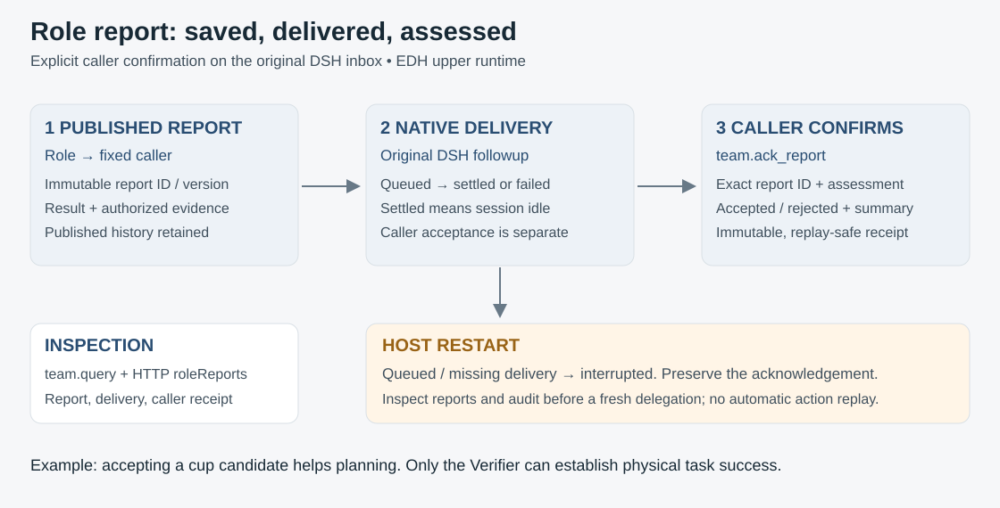

# Role reports, delivery and caller acknowledgement

These are EDH task semantics on the original DSH sessions and inbox. They do not
add a second message loop or establish physical success.



## Three separate facts

| Record | What it establishes | Example |
| --- | --- | --- |
| AcceptedReport | The role's versioned result is durably published with a fixed caller | Scene Analyst reported a cup candidate |
| ReportDelivery | The explicit DSH handoff was queued, reached quiescence, failed or was interrupted | Planner's turn settled; this alone says nothing about accepting the candidate |
| ReportAcknowledgement | The designated caller explicitly assessed that exact report version | Planner accepted the candidate for further planning; physical success is still unchecked |

`team.ack_report` is supplied to each role alongside `agent.report` and `team.query`.
For native model calls, dots become double underscores:

```json
{
  "assignmentId": "assignment-from-the-received-report",
  "reportId": "exact-report-id-from-the-received-message",
  "disposition": "accepted",
  "summary": "Candidate assessed for planning; physical completion still requires verification."
}
```

Pass this object to `team__ack_report`. The caller may use `rejected` with a reason.
Acknowledging an insufficient-context report can mean the request was assessed or
acted on; it does not complete the underlying assignment. A later completed report
has a different ID and needs its own acknowledgement.

The caller's identity is bound by the native tool scope. A report author cannot
confirm its own delivery to another role. A receipt is immutable; identical replay
returns the original acknowledgement and emits no duplicate event. Changing an
accepted/rejected assessment requires new explicit work and evidence rather than
rewriting the historical receipt. Acknowledgement is the caller's recorded statement,
not proof that all downstream business effects executed exactly once.

After task success, live sessions can still query and acknowledge reports, including
an Evolver's late result. This narrow permission does not admit new execution work.
Closed runs have no live role sessions and remain inspection-only.

## Published versions and crash boundaries

Reports retain immutable version records linked through `previousReportId`. A new
record becomes published only when the assignment's latest-report pointer advances.
Lookup follows that published chain: an orphan left before pointer commit is not
eligible for acknowledgement. The current single-writer journal enforces versions.

This also preserves earlier insufficient-context reports after final completion.
Pre-upgrade history may contain only the last available report; the runtime does not
invent missing earlier versions. Historical arrays and audit logs remain readable.

On server startup, published reports with queued or missing delivery state are marked
`interrupted` (or `recorded` for a user recipient). Existing settled/failed/interrupted
states and caller acknowledgements remain unchanged. Reconciliation is idempotent.
A caller may have acted before a crash, even if its delivery was still queued, so this
operation does not replay a model turn or resend a physical action.

Inspection supports deciding what to do next. A new task/delegation must supply the
relevant saved evidence explicitly. Automatic outbox redelivery, durable business
transactions and resumable DSH sessions remain future work.

## Inspect and verify

- `team.query({assignmentId})` returns native agent status, latest report, delivery,
  caller acknowledgement and a bounded page of version-history receipts to the role
  or its direct caller. Optional `beforeReportId` selects earlier versions and
  `includeBodies: true` includes the selected report contents.
- HTTP run projections expose `roleReports` with bounded receipt pages for assignments
  whose details remain inline. Archived assignments use explicit report inspection.
  The console's **Role reports** inspector selects an assignment, displays report
  bodies and supports **Earlier versions** and **Latest versions**. Restarted runs
  retain inspection access.
- `agent.report-acknowledged` identifies the acknowledging caller in `assignmentId`
  and the report author in `reportAssignmentId`, preserving actor attribution.
- [Role tests](../../tests/runtime/role-reports.test.ts) cover immutable replay,
  version history, orphan rejection and interrupted-delivery reconciliation.
- [Native extension acceptance](../../tests/runtime/team-extensions.test.ts) has an
  actual DSH Planner call `team__ack_report`; forged identity, self-confirmation and
  conflicting acknowledgements are rejected without changing task success.
- [HTTP restart acceptance](../../tests/runtime/console-server.test.ts) restores the
  report as interrupted and confirms that no inbox or physical work was replayed.

## Bounded history reads

Stored report bodies, delivery states and acknowledgements are validated on read.
Latest logical versions must equal their journal CAS versions. `readRecord(reportId)`
validates an immutable archive's identity, version and AgentReport shape. If the
current report has an archive, both bodies must agree exactly. Acknowledgements retain
immutable record versions, matching report IDs, bounded summaries and valid UTC times.
Delivery publication validates its shape before writing. `predecessor(record)` shares
link validation between history readers and retention inspection; a predecessor must
be an insufficient-context report from the same author, recipient and task scope.
Legacy current-only histories remain readable at their earliest available revision.

`AssignmentReports.iterate` traverses the published chain newest first, holding the
current record and its predecessor. Each link must preserve report ID, assignment,
agent, Team, task scope and recipient while decreasing the version by exactly one.
An invalid or missing predecessor fails where it is encountered. Legacy histories
without a predecessor link end at their earliest available record.

`page(assignmentId, beforeReportId?)` returns at most sixteen reports with a 256 KiB
encoded receipt/body target. It includes one individually oversized record to ensure
progress. Page records are ordered oldest to newest. The response includes the
current `latestReport` and `nextBeforeReportId`; the latter identifies the earliest
record in the page when older published records exist. Pass that value back as
`beforeReportId`. A cursor is exclusive and must occur in the assignment's published
chain. Appending a new report preserves an earlier cursor and its remaining history.

`status` exposes those records as `reportHistory` receipts, with optional bodies and
`reportHistoryPage` cursor metadata. The latest report is returned independently of the
selected history page. Its body and current delivery/acknowledgement add to the page
budget. Each receipt retains its own delivery and acknowledgement state. Returned
objects are detached from stored records.

```text
GET /api/runs/{runId}/reports?assignment={assignmentId}
GET /api/runs/{runId}/reports?assignment={assignmentId}&before={nextBeforeReportId}
```

The HTTP reader requires that the selected assignment belongs to the stored run and
that its report has the same task scope. Unknown, duplicate or malformed query fields
fail. The console reads this endpoint through its existing JSON transport and displays
report text as text content. Changing assignments starts at their latest page; closing
the inspector invalidates pending results.

Acknowledgement locates the exact report through the same published-chain iterator,
retaining recipient and immutable-replay checks. Startup scans latest-report pointers
one at a time and reconciles each chain incrementally. Explicit `history()` remains
available for callers that intentionally request a complete array.

Cursor admission currently traverses the published prefix to prove membership; deep
historical pages and acknowledgements have linear read cost. The service keeps no
complete-history cache. Run projections retain compact retired assignment metadata;
their report bodies remain available through this explicit route. Inline active roles
retain their latest report. See [assignment history](assignment-history.md). Total
metadata size and other run collections still need lifecycle limits.

`pnpm test:report-history` runs seven actual journal/HTTP/process checks for page
continuity, byte budgets, detached reads, unpublished/foreign cursors, predecessor
integrity, immutable acknowledgement and interrupted-delivery reconciliation. A child
process writes more than 100 MiB of actual project-document reports under a 64 MiB V8
old-space limit, visits all pages, acknowledges the earliest report and reconciles
delivery state. This measures report-history memory behavior; live model task behavior
and whole-application memory remain separate acceptance requirements.

See [upper runtime](upper-runtime.md) and [progress](progress.md).
Application retention declarations are described in
[report and receipt owners](domain-retention.md#report-and-receipt-owners).
