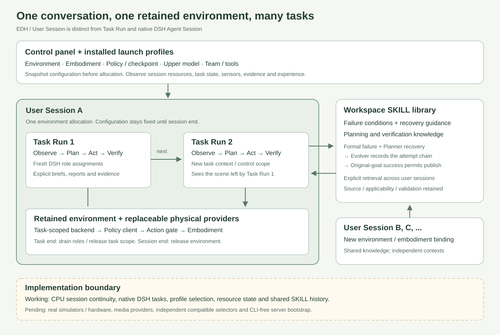

# User sessions and the console launcher

A user session is one conversation workspace with one retained environment allocation.
It contains sequential task runs. Each task creates independent DSH role assignments;
role contexts are not silently shared between tasks or agents. The environment and
workspace SKILL library have different lifetimes from those assignments.

Example: task A places a cup in a cabinet; task B closes its door. Task B must observe
the scene left by A. Starting B must not reset the environment. A new user session
allocates a new environment unless an installed provider explicitly binds a persistent
hardware resource. Task success and environment release are separate states.

## Implemented boundary

`ServerDeployment.launchProfiles` registers trusted launch configurations. Each binds
an environment label, embodiment, policy/checkpoint, default upper model, permitted
task presets and optional validated physical profile. Executable factories and provider
validators remain server-side. All profile Teams are loaded and frozen before opening
storage; their digests participate in admission identity. Explicit role model bindings
still override the selected default. Profiles are installed configuration combinations,
not arbitrary browser-provided checkpoint paths or executable code.

`SessionEnvironment.createTaskBackend(taskId, {signal})` returns a fresh task control
scope over the same environment. Its `EmbodiedBackend.close()` releases only that scope;
`SessionEnvironment.close()` stops and releases the environment. Providers must clean
partial allocations if their factory throws, reject concurrent device ownership, isolate
late task events and acknowledge real release. The server cannot infer robot safety
from a resolved JavaScript promise. Failed cleanup remains `unknown`.

The CPU launcher validates persistent synthetic world state, independent task/role IDs,
recovery publication before task-scope cleanup, history and shared SKILL retention. It
is not a simulator integration. Legacy `/api/runs` remains a single-task entry point and
cannot allocate while a user session owns the environment.

## HTTP and lifecycle

- `GET /api/config`: installed launch profile catalog, task/model bindings.
- `POST /api/sessions`: `{profileId, requestId}` allocates one user session.
- `GET /api/sessions`: session history, actual stored configuration and active ID.
- `GET /api/sessions/:id`: state, resource disposition and task IDs.
- `POST /api/sessions/:id/tasks`: `{scenario, requestId}` starts an allowed task.
- `POST /api/sessions/:id/close`: `{}` ends the session and releases the environment.
- Existing run detail, SSE, pause, resume-request, stop and audit endpoints remain.
- `GET /api/skills`: up to 100 stored bundles with originating run/session links.

A session progresses through `opening → ready → running → draining → ready` for each
task, then `closing → closed`. Drain waits for pending role receipts and Evolver work
before closing task scopes. End-session cancels outstanding work before waiting for
cleanup. Closing during recovery can therefore cancel unfinished learning; it cannot
publish unverified experience. Unknown cleanup errors block another allocation in the
same process. Admission requests are configuration-bound and deduplicated. After a
restart, unfinished sessions become `interrupted / unknown`, with no physical command
replay. Historical sessions are read-only; provider resource reconciliation remains an
integration requirement. A closed session retains its conversation task records and skills.

## Experience scope

The library is workspace-wide, across user sessions and provider types. Retrieval is
explicit, and applicability/validation metadata remains authoritative. A lesson learned
in simulation may inform a hardware plan; this does not establish hardware transfer
success. Fixture experience remains labeled and excluded from non-fixture retrieval.
Raw hidden agent context is not an experience transport.

## Remaining launcher work

1. Add independently selectable compatible environment/embodiment/policy/checkpoint
   fields backed by installed provider catalogs. Current selection is a validated bundle.
2. Connect actual simulation/hardware allocations, owned workers, action admission and
   device resource reconciliation. No real provider is bundled in the CPU demo.
3. Support free-form conversational task admission with explicit success contracts and
   scoped prior-task context handoff. Current tasks are deployment-registered presets.
4. Package a desktop/service bootstrap so opening the panel can start its local server.
   The panel controls sessions once the server is running; a browser cannot start its
   own unavailable HTTP server. CLI-free bootstrap is not yet implemented.
5. Add bounded history/media retention, knowledge filtering and measured transfer
   evaluations. Multiple concurrent environment sessions are not supported yet.
